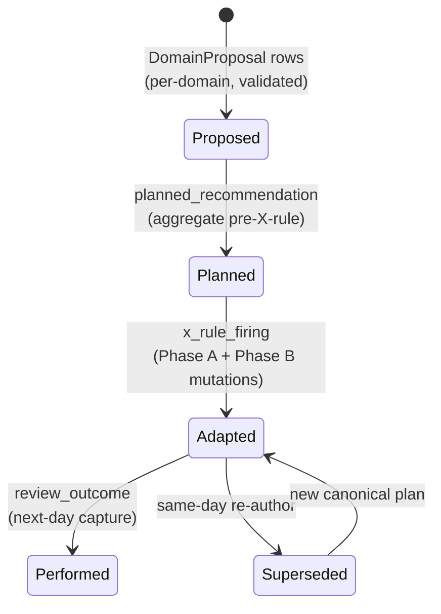

# Architecture

One-page architecture for the HAI reference runtime. The repo-wide research
frame is in [`PROJECT_FRAME.md`](PROJECT_FRAME.md) and
[`PROJECT_OPERATING_MODEL.md`](PROJECT_OPERATING_MODEL.md); this file
explains the runtime contract HAI contributes to that frame.

Health Agent Infra is the local plugin/runtime wrapper around a
shell-capable personal-health agent. The agent remains the conversational
operator. `hai` is the governed tool surface that tells the agent what it
may do, which substrates each command may mutate, which outputs must
validate, and which actions are refused. For the full architecture, see
[`docs/hai/architecture.md`](docs/hai/architecture.md).

## Single Rule

The agent can converse, decide what workflow to run, ask clarification
questions, and propose bounded recommendations. It must do health-state work
through `hai`.

`hai` owns the deterministic authority boundary:

- which commands exist (`hai capabilities --json`);
- whether the agent may call them (`agent_safe`);
- what each command may mutate (`read-only`, `writes-state`,
  `writes-sync-log`, `writes-audit-log`, `writes-memory`,
  `writes-skills-dir`, `writes-credentials`, `writes-config`,
  `interactive`);
- which proposal, intake, target, review, and synthesis payloads validate;
- which rows are committed to local SQLite and JSONL audit logs.

> The agent proposes and explains; the wrapper validates, gates, mutates, and
> records.

## Agent Wrapper Model

```text
user conversation
      |
      v
shell-capable agent
      |
      | reads skills + hai capabilities
      | invokes only declared hai commands
      v
Health Agent Infra wrapper
      |
      +--> ENABLES: pull evidence, record intake, build snapshots,
      |             classify domains, create bounded proposals,
      |             synthesize a daily plan, explain, review, back up
      |
      +--> PREVENTS: direct DB edits, invented actions, silent target/intent
      |              activation, fixture data in real state, unsupported
      |              clinical claims, missing-evidence confidence
      |
      +--> MUTATES: local SQLite state, JSONL audit logs, keyring/config;
      |             read-only commands may emit caller-requested files
      |
      +--> EVALUATED BY: pytest contracts today; scenario/persona/skill
                         harnesses now and richer personal-guidance evals next
```

## Daily Loop

```text
pull / intake -> projectors -> accepted_*_state_daily tables
                                      |
                                      v
                         hai state snapshot --as-of <date>
                                      |
                                      v
                     domain skills emit DomainProposal x 6
                                      |
                                      v
                              hai propose -> proposal_log
                                      |
                                      v
             Phase A X-rules apply mechanical draft mutations
                                      |
                                      v
                  optional daily-plan-synthesis rationale overlay
                                      |
                                      v
              Phase B X-rules adjust action_detail where allowed
                                      |
                                      v
      atomic commit: daily_plan + x_rule_firing
                   + planned_recommendation + recommendation_log
                                      |
                                      v
                         hai today / hai review record
```

`hai daily` ships the runtime-only path today. The synthesis skill overlay
is an opt-in two-pass path: `hai synthesize --bundle-only`, then
`hai synthesize --drafts-json <p>`.

## Memory Tiers

- **Local state memory** - `accepted_*_state_daily` tables store canonical
  per-domain day-level state.
- **Decision memory** - `proposal_log`, `planned_recommendation`,
  `daily_plan`, `x_rule_firing`, and `recommendation_log` preserve planned
  intent, mutations, and adapted recommendations.
- **Outcome memory** - `review_event` and `review_outcome` record what
  happened, on-device.

## Six Domains

`recovery - running - sleep - stress - strength - nutrition`

Each ships its own `domains/<d>/{schemas,classify,policy}.py` plus a
matching skill. The synthesis layer reconciles proposals through 11 X-rules:
10 Phase A rules and one Phase B adjustment rule.

## Agent Contract

`hai capabilities --json` emits the authoritative machine-readable manifest
of every subcommand: mutation class, idempotency, JSON behavior, agent-safe
flag, exit codes, flags, and selected output schemas. The human mirror is
[`docs/hai/agent_cli_contract.md`](docs/hai/agent_cli_contract.md).

The `intent-router` skill consumes this manifest as the natural-language to
CLI mapping surface. If a workflow is absent from the manifest, the agent
asks for clarification or stops; it does not issue raw SQL, write JSONL by
hand, or invent a replacement command.

## Three-State Audit Chain

Every recommendation is reconcilable across persisted rows:



1. **`proposal_log`** - what a per-domain skill proposed.
2. **`planned_recommendation`** - the aggregate pre-X-rule plan.
3. **`daily_plan` + `recommendation_log`** - the adapted committed plan.

`hai explain` renders the chain from persisted rows alone. Every X-rule
firing carries a stable public slug plus a sentence-form `human_explanation`
that the agent narrates verbatim.

## Governance Invariants

- W57: agent-proposed intent/target activation requires explicit user commit.
- No autonomous training-plan or diet-plan generation.
- No clinical claims.
- Local-first package posture; no package telemetry.
- No write path bypasses the three-state audit chain.

Full agent-facing guidance is in [AGENTS.md](AGENTS.md).

## Read Deeper

- [`docs/hai/architecture.md`](docs/hai/architecture.md) - full pipeline
- [`docs/hai/explainability.md`](docs/hai/explainability.md) - three-state audit detail
- [`docs/hai/x_rules.md`](docs/hai/x_rules.md) - X-rule catalogue
- [`docs/hai/state_model_v1.md`](docs/hai/state_model_v1.md) - state schema
- [`docs/hai/non_goals.md`](docs/hai/non_goals.md) - scope discipline
- [`docs/hai/tour.md`](docs/hai/tour.md) - 10-minute reading tour
