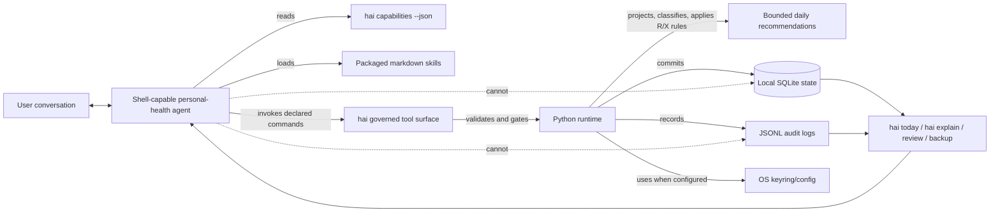

# Health Agent Infra

Health Agent Infra is the local plugin/runtime wrapper around a
shell-capable personal-health agent.

You talk to an agent. The agent invokes the local `hai` CLI. The
agent remains the conversational operator. `hai` is the governed tool
surface that tells the agent what it may do, which local substrates
each command may mutate, which outputs must validate, and which
actions are refused.

The package is working single-user software. It is currently packaged
and tested around Claude Code as the first compatible agent surface,
but the core contract is a local CLI plus machine-readable capability
manifest, not a Claude-only backend.

[](https://pypi.org/project/health-agent-infra/)
[](verification/tests/)
[](pyproject.toml)
[](LICENSE)

> **Status.** Working maintainer-dogfooded software. Non-maintainer
> full-flow validation is pending: the recorded session against
> `health-agent-infra==0.1.15.1` is the empirical input that feeds
> v0.1.16. Treat headline claims as maintainer-verified, not yet
> independently reproduced.

## Product boundary



The agent proposes, explains, and asks for missing context. The wrapper
validates, gates, mutates, and records.

Goals are user-owned, not agent-owned: the agent may *propose* intent
or training/nutrition target rows, but only you can *commit* them
(governance invariant W57). The runtime enforces this mechanically —
the commit/archive paths are marked `agent_safe == false` in the
capabilities manifest. See
[`reporting/docs/host_agent_contract.md`](reporting/docs/host_agent_contract.md)
for the host-agent operating rules.

## Two-minute on-ramp

These commands are for **inspection and setup** — verifying that the
package installed, that credentials are configured, and that the
runtime is healthy. The day-to-day surface is conversational: you
talk to a host agent (Claude Code or equivalent), the agent invokes
`hai` for you. Run these yourself once to confirm the install:

```bash
pipx install health-agent-infra
hai init
hai capabilities --human
hai doctor
hai daily
hai today
```

Use the pinned CDN-bypass install only in the first few minutes after
a fresh PyPI publish:

```bash
pipx install --force --pip-args="--no-cache-dir --index-url https://pypi.org/simple/" 'health-agent-infra==0.1.15.1'
```

The intended interface is an agent, but the runtime is normal local
software. `hai capabilities --json` is the contract the agent reads;
`hai doctor`, `hai daily`, `hai today`, and `hai explain` are the
first commands a human should inspect.

## Why this exists

Agentic AI in health fails when the agent is asked to be everything at
once. The same model is asked to be chat interface, memory layer, data
interpreter, planner, database writer, validator, and auditor.

That breaks down in predictable ways:

| Failure mode | What goes wrong |
|---|---|
| No durable local state | The agent reasons from chat memory or ad hoc files instead of an inspectable health-state database. |
| Non-deterministic interpretation | The same wearable data or self-report can be interpreted differently from run to run. |
| Unsafe write path | The agent can blur the line between proposing a change and mutating user state. |
| Weak validation | Plans become prose before required evidence, targets, and constraints are present. |
| Source ambiguity | Stale data, fixture data, live-source failures, and missing credentials collapse into vague "no data" prose. |
| Cross-domain drift | Running, recovery, sleep, stress, strength, and nutrition get planned independently even though useful guidance depends on their interaction. |
| Prompt-only governance | Safety depends on telling the model to behave instead of constraining the tools it can call. |

Health Agent Infra fixes those failure modes by moving the durable,
deterministic, and auditable parts into local software. The LLM stays
where it is strongest: conversation, clarification, summarisation, and
domain-specific rationale over a bounded state surface.

## What the product does

Health Agent Infra wraps an agentic personal-health workflow in local,
deterministic infrastructure. It gives the agent a governed CLI and a
SQLite-backed state layer for wearable pulls, manual intake, typed daily
projections, deterministic classifiers, policy rules, bounded proposals,
and auditable commits.

It also gives the agent operational surfaces that a plain chat agent
does not have: source freshness checks, credential diagnostics,
structured intake gaps, explicit user commit gates for targets and
intent, backup/restore/export, and an explanation surface that
reconstructs recommendations from persisted rows. Generated capability
docs, contract tests, scenario fixtures, and persona runs keep the
agent-facing surface from drifting silently as the runtime changes.

In practice:

1. You converse with the agent about training, recovery, sleep,
   nutrition, stress, and missing context.
2. The agent reads `hai capabilities --json` to understand exactly
   which commands are safe and what each command can mutate.
3. `hai` performs the local state operations: pulling or recording
   evidence, projecting typed rows, and preserving the health-state
   database.
4. Python code interprets the data with deterministic classifiers,
   policy rules, validation, and cross-domain X-rules.
5. Markdown skills help the agent explain uncertainty, ask better
   questions, and write rationale.
6. The runtime blocks missing or unsafe states, applies cross-domain
   adjustments, and performs the final state write.
7. Review, explanation, and recovery commands make the result
   inspectable after the fact.

The core rule:

> The agent can propose and explain; the runtime validates and commits.

## Where the product stands

The current published package is `health-agent-infra==0.1.15.1`
from 2026-05-03. It is the v0.1.15 single-user package plus a Linux
keyring hotfix.

| Area | Current state |
|---|---|
| Daily loop | Working and dogfooded: pull/clean/snapshot, intake gaps, proposal gate, synthesis, `hai today`. |
| State and audit | Local SQLite, 25 migrations, six accepted-state domains, proposal/planned/adapted/review rows. |
| Agent contract | 60 annotated commands with mutation class, idempotency, JSON behavior, exit codes, and agent-safety metadata. |
| Source handling | intervals.icu preferred; Garmin live marked unreliable; CSV fixture guarded from canonical state by default. |
| User-governed commits | Agent-proposed targets and intent rows require explicit non-agent `commit` / `archive` authority. |
| Review and explanation | `hai explain`, `hai review record`, and `hai review summary` reconstruct why a plan changed and how it landed. |
| Recovery and portability | `hai backup`, `hai restore`, and `hai export` preserve local state and refuse incompatible schema restores by default. |
| Future loops | Weekly review and longer-horizon planning are planned on top of the same provenance rows; they are not product loops yet. |
| External validation | PyPI package published; the recorded non-maintainer full-flow session is still pending and feeds v0.1.16. |

For the terse release-truth map, read
[`reporting/docs/current_system_state.md`](reporting/docs/current_system_state.md).

## The loops this enables

Health Agent Infra is infrastructure around a health-state database.
The loops are the product surface it enables for an agent.

| Loop | Status | What it enables |
|---|---|---|
| Daily planning | Current | Pull data, ask for missing context, check readiness, create bounded domain proposals, and commit one audited daily plan. |
| Intake and correction | Current | Turn user narration into structured readiness, stress, nutrition, note, target, intent, and gym rows. |
| Source quality | Current | Track sync freshness, distinguish fixture/live sources, surface credential status, and mark Garmin live as unreliable. |
| Review | Current | Record whether yesterday's recommendation was followed/helpful and link outcomes through superseded plans. |
| Explanation | Current | Reconstruct "why did this change?" from persisted proposal, planned, X-rule, plan, and recommendation rows. |
| Targets and planning | Partial | Store governed targets and intent rows; agent-proposed rows still require explicit user commit. |
| Backup and recovery | Current | Back up, restore, export, and refuse incompatible schema restores by default. |
| Weekly review | Planned | Use preserved evidence, proposals, X-rule firings, recommendations, and outcomes as the substrate for v0.2.0. |
| Longer-horizon planning | Future | Build broader planning authority only after daily state, review memory, and provenance are strong enough. |
| Evaluation and regression | Internal | Keep agent-facing behavior stable with tests, persona harnesses, eval scenarios, and generated CLI checks. |

## How it feels to use

```text
User:  "Plan today. I slept badly and my quads are sore."
Agent: Reads `hai capabilities`, invokes the local runtime, asks for missing context.
hai:   Pulls wearable data, updates local state, and classifies six domains.
Agent: Uses the skills to explain uncertainty and post bounded proposals.
hai:   Applies deterministic cross-domain rules and commits the daily plan.
User:  "Why did you soften the run?"
Agent: Runs `hai explain --operator` and answers from persisted rows.
```

The user experience is conversational. The system architecture is not.
The agent talks; the runtime governs.

## Why it is different

- **Local state, not chat memory.** The system maintains a structured
  health-state database instead of asking the LLM to remember health
  history inside a conversation.
- **Deterministic interpretation.** Wearable data and manual intake
  are projected into typed state before recommendations are made.
- **Validated write path.** The agent cannot bypass the CLI contract
  to mutate state directly.
- **Source honesty.** Fixture data, live-source failures, stale syncs,
  and missing credentials are visible to the agent instead of being
  collapsed into vague "no data" prose.
- **Cross-domain planning without free-form authority.** X-rules let
  sleep, recovery, nutrition, stress, running, and strength constrain
  each other mechanically before prose is written.
- **User-governed commitments.** Agent-proposed targets and intent
  rows do not become active just because an agent suggested them.
- **Code and skills have separate jobs.** Python owns bands, R-rules,
  X-rules, validation, supersession, and commits. Markdown skills own
  explanation, uncertainty, and clarification.
- **Agent-native contract.** `hai capabilities --json` tells the agent
  exactly which commands exist, what they can mutate, and whether they
  are agent-safe.
- **Auditable by construction.** Use `hai today`,
  `hai explain --operator`, `hai doctor`, and `hai stats` instead of
  raw SQLite as the first inspection path; these commands resolve
  supersession chains and schema churn.

## Install

The intended interface is an agent, but these are normal CLI commands.
Humans run them directly for setup, inspection, debugging, and recovery;
normal planning use is agent-mediated through the same contract.

```bash quickstart
pipx install health-agent-infra
# OR for a dev checkout: pip install -e .
hai init
hai auth intervals-icu
hai capabilities --human
hai doctor
hai daily
hai today
```

Immediately after a new publish, PyPI CDN cache lag can briefly hide
the newest wheel. Use the pinned bypass form when you need the just
published version immediately:

```bash
pipx install --force --pip-args="--no-cache-dir --index-url https://pypi.org/simple/" 'health-agent-infra==0.1.15.1'
```

`intervals_icu` is the preferred live source. Garmin Connect support is
best-effort because Garmin login is rate-limited and can fail behind
Cloudflare; use `--source garmin_live` only when you explicitly want
that path. If no live credentials are configured, the runtime can use
the committed CSV fixture for demos and smoke tests.

On macOS, credentials use the OS keychain. On Linux, v0.1.15.1 includes
`keyrings.alt` and a defensive fallback so setup/status commands do not
crash when no desktop keyring backend is registered.

## Daily workflow

`hai daily` is the current product loop. It runs the runtime-owned
part of the day and tells the agent what still needs to happen.

1. `pull` fetches evidence and records sync freshness.
2. `clean` normalizes evidence into typed accepted-state rows.
3. `snapshot` builds the six-domain state bundle.
4. `gaps` reports missing user-closeable inputs.
5. `proposal_gate` reports whether proposals are still needed.

When proposals are needed, the agent uses the domain skills and writes
one bounded `DomainProposal` per expected domain with `hai propose`.
Then `hai daily` or `hai synthesize` completes the atomic commit.

The daily loop is not the whole product; it is the first complete
agent-operable loop. The same state and provenance model is what
weekly review, longer-horizon planning, and future evaluation surfaces
build on.

The full integration contract is in
[`reporting/docs/agent_integration.md`](reporting/docs/agent_integration.md).

## Reading your plan

`hai today` is the user-facing read surface for the committed daily
plan:

```bash
hai today
hai today --as-of 2026-04-23
hai today --domain recovery
hai today --format json
```

For dense audit output:

```bash
hai explain --operator
```

`hai explain` reconstructs the plan from persisted rows. It does not
recompute the day from scratch.

## Recording your day

The review loop records whether the recommendation was followed and
whether it helped:

```bash
hai review record --outcome-json <path>
hai review summary
hai review summary --domain recovery
```

Review rows are append-only. If you record an outcome against a
morning plan and later re-author the day, the outcome is routed to the
canonical leaf recommendation for the same domain. `followed_recommendation`
and `self_reported_improvement` must be strict booleans.

## Domains

The current runtime covers six daily domains:

| Domain | What it covers |
|---|---|
| recovery | HRV/RHR readiness, soreness, energy, recovery constraints |
| running | recent activities, load, ACWR, session readiness |
| sleep | duration, debt, deprivation risk, recovery interaction |
| stress | self-report and stress trend signals |
| strength | gym set intake, exercise taxonomy, volume spikes |
| nutrition | daily macro totals and target-aware suppression |

Domain breadth is not the main claim. The main claim is that each
domain has a typed state representation, known evidence inputs,
classifier and policy boundaries, provenance, and an auditable plan
surface. New domains should follow that pattern rather than becoming
more prompt text.

Nutrition is daily macros-only in v1, not meal-level tracking. Body
composition, micronutrients, clinical claims, and autonomous diet
plans are intentionally out of scope.

## Calibration

A fresh install can produce recommendations on day one, but useful
personal calibration takes history.

| Window | What to expect |
|---|---|
| Days 1-14 | Cold-start mode for running, strength, and stress. Review recommendations consciously. |
| Day 14 | HRV and RHR rolling baselines begin to stabilize. |
| Days 14-28 | Recovery, sleep, and stress trend signals become more useful. |
| Day 28 | ACWR chronic load and strength volume ratios stop being mechanically inflated. |
| Day 60+ | Trend bands start carrying real signal. |
| Around day 90 | Steady-state personal calibration. |

Cold-start relaxation is asymmetric by design: running, strength, and
stress can soften some coverage blocks; recovery, sleep, and nutrition
do not relax into confident guesses when evidence is thin.

## Where your data lives

| What | Default path | Override |
|---|---|---|
| State DB | `~/.local/share/health_agent_infra/state.db` | `$HAI_STATE_DB`, `--db-path` |
| Intake/proposal JSONL | `~/.health_agent/` | `$HAI_BASE_DIR`, `--base-dir` |
| Config | macOS: `~/Library/Application Support/hai/`; Linux: `~/.config/hai/` | `hai config init --path <p>` |

Run `hai doctor` to confirm resolved paths, schema version, source
freshness, credential status, and skill installation.

## First-run notes

- `hai today` needs a committed plan. If there is no plan yet, run
  `hai daily`.
- If `hai daily` stops at `awaiting_proposals`, the agent still needs
  to post bounded domain proposals.
- `hai doctor --deep` performs live API checks; plain `hai doctor`
  checks local setup and credential presence.
- Garmin live is explicitly less reliable than intervals.icu.
- USER_INPUT exits should include the next action. If one does not,
  that is a bug.

## Boundaries

The project is health-agent infrastructure, not an autonomous doctor,
coach, dietitian, wearable platform, or cloud service.

- It does not diagnose, treat, or make clinical claims.
- It does not let the agent silently activate goals, targets, intent,
  or final plans without the governed write path.
- It does not ask the LLM to be the database, validator, migration
  layer, source-of-truth, or policy engine.
- It does not replace wearables or source APIs; it records and
  governs the evidence they provide.
- It does not treat missing, stale, fixture, or unreliable data as
  equivalent to live evidence.
- It does not solve every health-agent failure case yet. Weekly
  review, longer-horizon planning, richer personal guidance evals,
  and broader source-quality policy are still staged work.

## Main command groups

```bash
# Evidence and daily orchestration
hai pull [--source intervals_icu|garmin_live|csv] --date <d>
hai clean --evidence-json <p>
hai daily [--domains <csv>]

# Proposals and synthesis
hai propose --domain <d> --proposal-json <p>
hai synthesize --as-of <d> --user-id <u>
hai synthesize --bundle-only

# State and audit
hai today
hai explain --for-date <d> --user-id <u>
hai state init | migrate | read | snapshot | reproject
hai doctor | stats | capabilities

# Intake, review, targets
hai intake gym|exercise|nutrition|stress|note|readiness ...
hai review schedule | record | summary
hai intent training add-session | sleep set-window | list | commit | archive
hai target set | nutrition | list | commit | archive
```

`intent commit`, `intent archive`, `target commit`, and `target archive`
are explicit user/operator authority paths, not agent-safe autonomous
actions.

The authoritative command surface is generated at
[`reporting/docs/agent_cli_contract.md`](reporting/docs/agent_cli_contract.md)
and from `hai capabilities --json`.

## Read next

| Reader | Best next docs |
|---|---|
| User trying the package | [`reporting/docs/current_system_state.md`](reporting/docs/current_system_state.md), [`reporting/docs/privacy.md`](reporting/docs/privacy.md), [`reporting/docs/non_goals.md`](reporting/docs/non_goals.md) |
| Host-agent integrator | [`reporting/docs/host_agent_contract.md`](reporting/docs/host_agent_contract.md), [`reporting/docs/agent_integration.md`](reporting/docs/agent_integration.md), [`reporting/docs/agent_cli_contract.md`](reporting/docs/agent_cli_contract.md), [`ARCHITECTURE.md`](ARCHITECTURE.md) |
| Runtime contributor | [`CONTRIBUTING.md`](CONTRIBUTING.md), [`reporting/docs/architecture.md`](reporting/docs/architecture.md), [`reporting/docs/domains/README.md`](reporting/docs/domains/README.md) |
| Maintainer or release auditor | [`REPO_MAP.md`](REPO_MAP.md), [`AUDIT.md`](AUDIT.md), [`ROADMAP.md`](ROADMAP.md), [`reporting/plans/README.md`](reporting/plans/README.md) |

## Roadmap and proof

- [ROADMAP.md](ROADMAP.md) - now, next, later.
- [AUDIT.md](AUDIT.md) - release audit index.
- [CHANGELOG.md](CHANGELOG.md) - public release history.
- [`reporting/docs/current_system_state.md`](reporting/docs/current_system_state.md) - current shipped truth.
- [`reporting/docs/architecture.md`](reporting/docs/architecture.md) - full architecture.
- [`reporting/docs/non_goals.md`](reporting/docs/non_goals.md) - scope boundaries.
- [`reporting/docs/x_rules.md`](reporting/docs/x_rules.md) - cross-domain rule catalogue.
- [`reporting/docs/tour.md`](reporting/docs/tour.md) - 10-minute reading tour.

## License

MIT. See [LICENSE](LICENSE).
