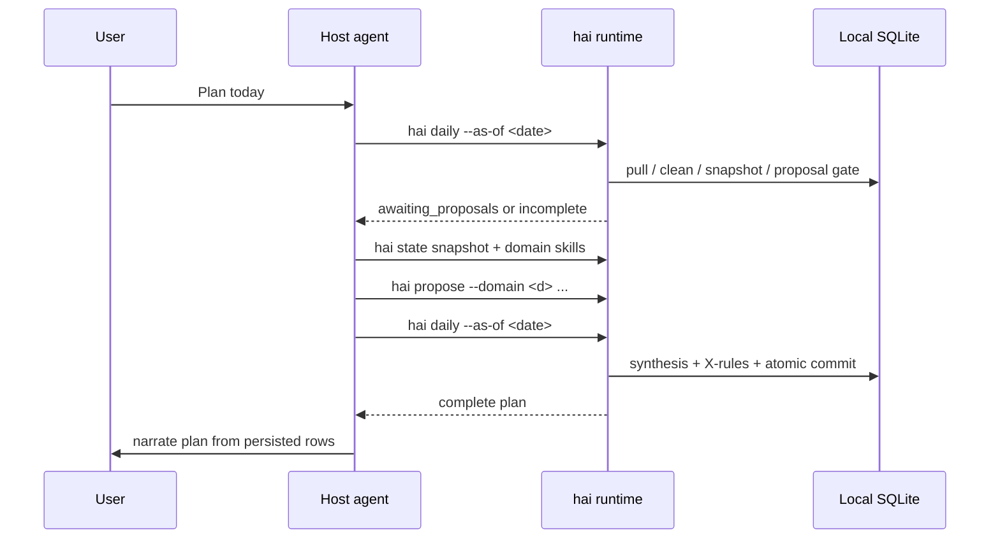

# Agent Integration

Health Agent Infra is the local plugin/runtime wrapper around a
shell-capable personal-health agent. This doc explains how a host agent
installs and uses the current HAI reference runtime. Claude Code is the first compatible
host surface, but the durable contract is the local `hai` CLI plus
`hai capabilities --json`. The human product loop is natural language;
the agent translates that intent into validated `hai` commands.

The package ships two things the agent consumes:

1. **A CLI called ``hai``** — deterministic subcommands on the
   user's PATH.
2. **Fourteen markdown skills** under ``skills/`` — six per-domain
   readiness skills, a synthesis skill, an intent-router skill
   (NL → CLI workflow mapping; consumes ``hai capabilities --json``),
   an expert-explainer skill, plus cross-cutting (strength-intake,
   merge-human-inputs, review-protocol, reporting, safety).

The agent reads skills, makes judgment calls, and invokes CLI
subcommands to move structured state. The CLI validates the
agent's output at the proposal, synthesis, review, intake, intent, and target
boundaries.

## Install

For a user install, the root README leads with `pipx install`, bare `hai init`
(post-v0.1.18 W-OB-2: on a TTY with incomplete onboarding state, auto-promotes
to the guided flow that prompts for intervals.icu credentials and authors
initial intent + target; opt-outs are `--non-interactive`,
`HAI_INIT_NON_INTERACTIVE=1`, or no TTY), `hai doctor`, and the first
inspection commands. A host-agent setup needs the same runtime plus installed
skills:

```bash
pipx install health-agent-infra
# or, from a dev checkout:
pip install -e .
hai setup-skills                # copies skills to ~/.claude/skills/
hai state init                  # creates the SQLite state DB + applies migrations
```

Immediately after a new PyPI publish, a pinned CDN-bypass install may be
needed for a few minutes:

```bash
pipx install --force --pip-args="--no-cache-dir --index-url https://pypi.org/simple/" 'health-agent-infra==0.2.0'
```

Verify:

```bash
hai --help
ls ~/.claude/skills/
# recovery-readiness  running-readiness  sleep-quality  stress-regulation
# strength-readiness  nutrition-alignment  daily-plan-synthesis
# intent-router  expert-explainer
# strength-intake  merge-human-inputs  review-protocol  reporting  safety
```

## Claude Code

Claude Code discovers the skills automatically from
``~/.claude/skills/``. Each skill's ``allowed-tools`` frontmatter
scopes the CLI subcommands it may invoke — e.g., the
``recovery-readiness`` skill allows
``Bash(hai propose --domain recovery *)`` but nothing else.

Typical daily loop:



1. User: "Plan my day."
2. Agent invokes ``hai daily``. The orchestrator pulls, cleans,
   snapshots, computes gaps, and stops at the proposal gate when it
   needs domain proposals.
3. If the status is ``awaiting_proposals`` or ``incomplete``, the
   agent reads the snapshot and the relevant readiness skills, honours
   any ``policy_result.forced_action`` / ``capped_confidence``,
   composes a ``DomainProposal``, and invokes ``hai propose --domain
   <d> --proposal-json <p>`` for each missing domain.
4. Agent invokes ``hai daily`` again. With the expected proposals in
   `proposal_log`, the runtime applies Phase A mutations, runs Phase B,
   and atomically commits the `daily_plan` + `x_rule_firings` + N
   recommendations in one SQLite transaction.
5. Agent uses the ``reporting`` skill to narrate the synthesised plan
   back to the user.
6. Lower-level debug/operator flow is still available: ``hai pull`` /
   ``hai clean`` / ``hai state snapshot`` / ``hai synthesize``. The
   optional synthesis skill overlay uses the two-pass form:
   ``hai synthesize ... --bundle-only`` followed by
   ``hai synthesize ... --drafts-json <path>``.
7. Next morning: agent records outcomes via ``hai review record
   --outcome-json <path>``. The outcome payload is a typed JSON
   document carrying ``review_event_id``, ``recommendation_id``,
   ``user_id``, ``domain``, ``followed_recommendation`` (strict bool),
   ``self_reported_improvement`` (strict bool or null), plus the
   migration-010 enrichment fields. The review-record validator
   rejects non-boolean ``followed_recommendation`` /
   ``self_reported_improvement`` values with named invariants
   (``followed_recommendation_must_be_bool``, etc.) — an agent that
   passes ``"yes"`` instead of ``true`` will see a governed
   ``USER_INPUT`` exit, not a silent JSONL/SQLite truth fork.
   The agent obtains ``review_event_id`` and ``recommendation_id`` from
   generated review events, ``hai today --format json``, or
   ``hai explain``. It must not guess ids from date/domain patterns.

## Claude Agent SDK

Two supported paths:

1. **CLI subcommand dispatch** — the SDK agent shells out to
   ``hai``. Same flow as Claude Code; fully agent-agnostic.
2. **Direct Python imports for read paths** — if the SDK runs in the same
   Python environment where ``pip install -e .`` happened, the agent can
   ``from health_agent_infra.core.state.snapshot import
   build_snapshot`` and call functions directly. Skips subprocess
   overhead; couples the agent to Python. Mutation paths should still use
   the same validated runtime functions or the `hai` CLI, not ad hoc SQLite
   writes.

For the SDK, skill discovery is not automatic. Either upload skills
to the Anthropic Skills API or reference them by file path in your
agent's system prompt.

## Open Claude-equivalent agents

Any agent with both:

- A shell-exec tool (for ``hai`` subcommands), AND
- A way to load markdown fragments at session start (for the
  skills)

can drive this package. The wire contract is JSON at the three
determinism boundaries.

## Operating posture

An agent should treat `hai` as a governed tool surface, not as a
suggestion. Before a session it should read `hai capabilities --json`
for command existence, mutation class, flags, JSON behavior, and
exit-code semantics. It should prefer `hai daily`, `hai today`,
`hai explain`, `hai doctor`, and `hai stats` over raw SQLite reads
unless it is explicitly debugging the runtime.

When a command returns `USER_INPUT`, the correct response is usually
to ask the user for the missing state or run the next safe setup
command, not to retry with guessed flags. When a command refuses a
source, schema, clinical claim, or write boundary, the refusal is part
of the product contract.

### Minimum host-agent loop

For normal planning, prefer this loop over manual `pull` / `clean` /
`snapshot` / `synthesize` orchestration:

1. Read `hai capabilities --json`.
2. Run `hai daily --as-of <date>` or the default `hai daily`.
3. If status is `awaiting_proposals` or `incomplete`, read the snapshot
   and run the relevant domain skills.
4. Submit each missing bounded proposal with
   `hai propose --domain <d> --proposal-json <p>`.
5. Re-run `hai daily`; the runtime advances the proposal gate and commits
   synthesis when the expected proposal set is complete.
6. Narrate from `hai today`, `hai explain`, and review summaries rather
   than from unsaved proposal drafts.

Manual lower-level commands remain useful for debugging, evals, and
operator inspection. They are not the default agent loop.

### W57 intent and target gate

Intent and target rows are governed user state. Agent-authored suggestions
may be recorded as proposed rows, but activation and deactivation require
explicit user/operator authority:

- Agent suggestion: use the command shape that records
  `source=agent_proposed`, `status=proposed`, and an agent ingest actor
  where the command exposes those fields.
- User-authored instruction: only record `active` / `user_authored` when the
  user explicitly gave that instruction, not because the agent inferred it.
- `hai intent commit`, `hai intent archive`, `hai target commit`, and
  `hai target archive` are marked `agent_safe=false` in the capabilities
  manifest. A host agent must not run them autonomously.

This gate is the operational form of W57: the agent may propose user state;
it cannot activate or deactivate it.

### Source safety and freshness

Host agents should inspect source and data-quality fields before narrating
confidence:

- Prefer `intervals_icu` when configured.
- Treat `garmin_live` as unreliable; the capabilities manifest marks this in
  `flags[].choice_metadata`.
- Use the committed CSV source for demos, offline tests, or explicit
  non-canonical/demonstration state. Do not write fixture data into the
  canonical state DB unless the user explicitly requests the
  `--allow-fixture-into-real-state` path.
- If data is stale, fixture-derived, unavailable at source, or pending user
  input, say that plainly and ask for the user-closeable input or setup step.
  Do not collapse these states into generic missing data.

### Refusal and retry handling

Runtime handler failures use the stable taxonomy from
[`cli_exit_codes.md`](cli_exit_codes.md). For host agents:

- `USER_INPUT` means the caller or user can fix something; ask for the
  missing state, run the next safe setup command, or refresh capabilities.
- `TRANSIENT` means a retry may be reasonable after backoff, especially for a
  live source. Do not loop indefinitely.
- Argparse usage errors, unknown flags, and invalid choices can also exit
  with the literal process code `2`; treat those as caller input errors and
  re-read `hai capabilities --json` rather than retrying the same command.
- `NOT_FOUND` on read surfaces should lead to a different selector or a
  setup/planning step, not fabricated ids.

## Determinism boundaries

1. **``hai propose``** — validates a DomainProposal against
   ``core/writeback/proposal.py :: validate_proposal_dict``.
   Checked invariants: ``required_fields_present``,
   ``forbidden_fields_absent``, ``domain_supported``, ``domain_match``,
   ``schema_version``, ``action_enum``, ``confidence_enum``,
   ``bounded_true``, ``policy_decisions_present``, ``for_date_iso``.
   Violations exit ``USER_INPUT`` with a named ``invariant=<id>``
   stderr tag.

2. **``hai synthesize``** — refuses with ``SynthesisError`` when
   no proposals exist for the (for_date, user_id). Rolls back the
   entire transaction on any failure inside. Phase B firings are
   passed through a write-surface guard that rejects any attempt
   to mutate ``action`` or touch a domain not registered in
   ``PHASE_B_TARGETS``. The ``--bundle-only`` post-proposal
   skill-overlay seam refuses with ``USER_INPUT`` when no proposals
   exist for the (for_date, user_id) — bundle-only is not a
   pre-proposal inspection surface.

3. **``hai review record``** (v0.1.6) — validates the outcome
   payload against
   ``core/writeback/outcome.py :: validate_review_outcome_dict``.
   Checked invariants include ``required_fields_present``,
   ``followed_recommendation_must_be_bool`` (strict bool, not
   truthy strings/ints), ``self_reported_improvement_must_be_bool_or_null``,
   ``intensity_delta_enum``, ``pre_energy_score_in_range``,
   ``post_energy_score_in_range``. Validation runs at both the CLI
   and the ``record_review_outcome`` library entry point — direct
   Python callers cannot bypass it.

Recommendations reach ``recommendation_log`` exclusively through
``hai synthesize``. (The legacy recovery-only ``hai writeback`` direct
path was removed in v0.1.4 D2; use ``hai propose --domain recovery`` +
``hai synthesize``.)

Nothing persists until its determinism check passes. Callers can
pattern-match on the ``invariant`` id without parsing prose.

The ``hai daily`` orchestrator surfaces a fourth gate (proposal
completeness) that is not a determinism boundary in the schema
sense, but functions like one: it refuses to advance to synthesis
until every domain in ``expected_domains`` has a proposal in
``proposal_log``. Three statuses: ``awaiting_proposals`` (zero),
``incomplete`` (some, missing >=1), ``complete`` (all). The
``incomplete`` status carries a ``hint`` field naming the missing
domains so the agent knows exactly which DomainProposal rows to
post (or whether to narrow ``--domains`` to scope the day).

## What an agent should NOT do

- Modify JSONL or SQLite files directly. All state mutation goes
  through ``hai``.
- Claim more than the evidence supports. Rationale in a proposal
  must reference snapshot numbers (bands, deltas, ratios).
- Use diagnostic / clinical language. The safety skill + proposal /
  recommendation validators both reject it.
- Pre-bake Phase B adjustments (e.g. X9's protein-target bump).
  That is runtime territory; the synthesis skill must not write
  an ``action_detail`` reason_token that starts with ``x9_`` or
  equivalent.
- Call ``hai`` subcommands outside the ``allowed-tools`` scope of
  whichever skill is currently active.

## Snapshot schema v2 (v0.1.8 transition note)

`snapshot.schema_version` was bumped from `state_snapshot.v1` to
`state_snapshot.v2` in v0.1.8. The transition is purely additive —
every v1 field is preserved unchanged in shape. v1 consumers that
ignore unknown keys will continue to work without modification; v1
consumers that strictly enforce a closed key set should bump their
pinned version to v2 before upgrading.

The new fields:

- **`snapshot.<domain>.review_summary`** — code-owned per-domain
  review summary (W48). Carries counts, rates, intensity-delta
  distribution, source ids, and stable visibility-only tokens
  (`outcome_pattern_recent_negative`,
  `outcome_pattern_recent_positive`, `outcome_pattern_mixed`,
  `outcome_pattern_insufficient_denominator`). Skills may narrate
  these tokens but MUST NOT compute them or change actions from
  them.
- **`snapshot.<domain>.data_quality`** — per-domain data-quality
  block (W51). Carries `coverage_band`, `missingness`,
  `source_unavailable`, `user_input_pending`,
  `cold_start_window_state`. Mirrors the rows in
  `data_quality_daily` populated by the `hai clean` write path.
- **`snapshot.intent`** — top-level array of active intent rows
  whose `[scope_start, scope_end]` window covers `as_of_date`
  (W49). Each row carries the intent_item shape from migration
  019. Empty list pre-019 / when no active intent is set.
- **`snapshot.target`** — top-level array of active target rows
  whose effective window covers `as_of_date` (W50). Each row
  carries the target shape from migration 020. Empty list
  pre-020 / when no active target is set.

No v1 field was removed or had its shape changed. A v1 consumer
reading the v2 snapshot sees the same data it always saw, plus
new sibling fields it can ignore.

## MCP

No MCP server ships in the current reference runtime. A future wrapper
exposing CLI subcommands as MCP tools remains a deferred HAI support-lane
item unless it becomes paper-critical benchmark infrastructure.

## Where tools expect paths

- ``hai pull`` source resolution (v0.1.6+): explicit ``--source`` >
  legacy ``--live`` (= garmin_live; rate-limited and unreliable) >
  intervals.icu when credentials are configured > csv fixture
  fallback. intervals.icu is the supported live source; configure
  with ``hai auth intervals-icu``. The csv fixture lives at
  ``src/health_agent_infra/data/garmin/export/daily_summary_export.csv``
  for offline / test runs.
- ``hai state snapshot`` / ``hai state reproject`` default to
  ``~/.local/share/health_agent_infra/state.db`` (override via
  ``--db-path`` or ``$HAI_STATE_DB``).
- ``hai propose`` / ``hai review`` / ``hai intake *`` take
  ``--base-dir`` for JSONL audit logs; v0.1.6+ default is
  ``~/.health_agent/`` (override via ``$HAI_BASE_DIR``).
- ``hai setup-skills`` defaults to ``~/.claude/skills/``. Override
  via ``--dest``.
- ``hai config show`` prints the effective thresholds (defaults
  merged with user overrides at ``~/.config/hai/thresholds.toml``).

## Evaluating changes

After modifying a domain classifier or policy:

```bash
hai eval run --domain recovery
hai eval run --synthesis
```

The deterministic runtime layers are scored against packaged frozen
scenarios under ``src/health_agent_infra/evals/scenarios/``.

If you touched a skill, ``hai eval`` is not enough. Use the opt-in harnesses
under ``verification/evals/``:

- ``skill_harness/`` scores replay/live outputs for recovery and running
  readiness skills.
- ``synthesis_harness/`` scores ``daily-plan-synthesis`` output fixtures.

These harnesses are partial and not normal live CI. See
``verification/evals/skill_harness_blocker.md`` for what remains open.
