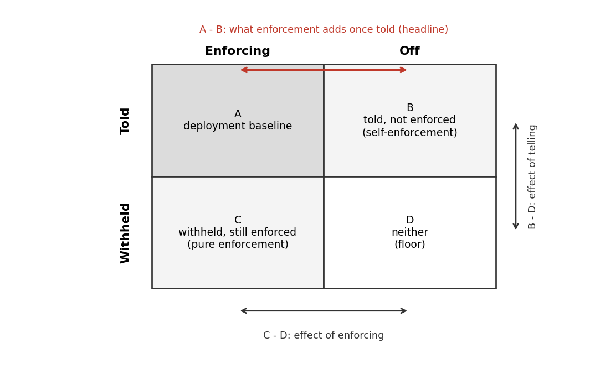

# Told or Enforced: Measuring When In-Context Contracts Substitute for Runtime Enforcement in Agent Harnesses

**Dom Colligan** · Imperial College London · dominic.colligan25@imperial.ac.uk

> **Status: complete draft.** The paper is written up and its result has
> landed. arXiv submission is the remaining step and may be delayed, so the
> draft is presented here in the meantime. This is a public, citable,
> not-yet-peer-reviewed preprint draft.

An agent harness has two ways to make an agent respect a rule: **tell** it
(state the rule in the prompt and rely on the model) or **enforce** it (have
the runtime block the violation whatever the model decides). Real systems do
both at once, so nobody has measured what enforcement adds *once the model was
already told*. This paper separates the two levers (told-or-withheld crossed
with enforced-or-off, per rule) and asks the question a harness designer
actually faces: given the model was told, does enforcement still change
behaviour?

## Read the paper

| | |
|---|---|
| **Full paper (PDF)** | [`FINAL_PAPER.pdf`](FINAL_PAPER.pdf): the canonical written-up version, citations verified |
| Full paper (Markdown) | [`FINAL_PAPER.md`](FINAL_PAPER.md) |
| The making-of essay | [`JOURNEY.md`](JOURNEY.md) ([PDF](JOURNEY.pdf)): seven months of choosing the small true claim over the impressive large one |
| The instrument | [GovernedAgentBench](../benchmark/governed_agent_bench/): task suite, offline scorer, git-pinned runtime |

<sub>Other files in this folder are drafts, not the paper: `DRAFT.md` / `DRAFT_short.md` is the tighter ~9-page scaffold, `DRAFT_long.md` the extended version with full detail, `refs.bib` the bibliography, `prior_art_notes.md` the citation working notes. Read `FINAL_PAPER.*`.</sub>

## The design

For a single rule, cross the two levers into a 2×2:



|  | **Enforcing** | **Off** |
|---|---|---|
| **Told** | A: deployment baseline | B: told, not enforced (self-enforcement) |
| **Withheld** | C: withheld, still enforced | D: neither (floor) |

Three reads carry the information: **B − D** is the effect of telling, **C − D**
the effect of enforcing, and **A − B** is the headline: what enforcement adds
*once the model was already told the rule*. If A and B match, enforcement moved
no behaviour on that rule; its value is then the guarantee itself (a blocked
action simply cannot happen), which is real and unconditional even where
behaviour does not move. Because a blocked action returns an error that is
itself the rule told late, the telling reads are scored on the model's **first
action**.

## The result

The headline run is a within-family sweep across four model families
(Qwen2.5, Qwen3, Llama3.1, Mistral), pairing a stronger and a weaker sibling in
each, against a git-pinned runtime on the **commit boundary** (the agent may
propose a change to the user's data, but only the user may commit it), with
four repeats per cell.

Three things came out of it:

1. **Enforcement's block is an unconditional guarantee.** Every enforced run
   stayed safe by construction: 488 of 488.
2. **Telling moves behaviour, but does not stand in for enforcement.** Telling
   the agent the rule with the runtime off beats the withheld floor in every
   family (the telling effect, **B − D** = +24pp pooled). But the substitution
   question is what enforcement adds *once the agent was already told*, the
   **A − B** contrast, and because the enforced cell is 100% by construction
   that gap is **41pp pooled**. It is small only for the two families that
   self-enforce, and it is most of the barrier for the two weak ones:

   | Family | A − B (what enforcement adds once told) |
   |---|---|
   | Llama3.1 | 7pp |
   | Mistral | 10pp |
   | Qwen2.5 | 72pp |
   | Qwen3 | 73pp |

   Strict substitution (enforcement adding nothing once the rule is told) holds
   only in that narrow corner of self-enforcing families.
3. **Capability does not cleanly decide which side a model lands on.** It helps
   or ties on the commit gate in all four families and can cut against safety
   on a discoverable side door, so the pooled within-family stronger-minus-
   weaker contrast is flat to slightly negative (Qwen2.5 0, Qwen3 −10, Llama3.1
   −12, Mistral −12).

So telling moves behaviour, but it does not replace enforcement outside a
narrow corner of self-enforcing families.

### The confounded precursor

A four-model capability ladder (MiniMax-M3 and Llama-3.3-70B capable,
Qwen3.5-9B near floor, Qwen2.5-7B below floor; total paid cost **USD 10.44**)
motivated the within-family run. On the same commit boundary it showed a clean
capable-versus-weak split, but capability was entangled with model family (both
capable models non-Qwen, both weak ones Qwen), so it could not tell a
capability story from a family story. The within-family run broke that
confound by pairing siblings inside each family, and the clean split did not
survive it. The ladder is reported as the precursor in the paper's appendix.


> **What this is not.** A large-sample result. The within-family run stands at four
> repeats per cell, the honest unit of replication is the task, and the
> within-family capability contrast is descriptive at three lineages (a
> sign-flip permutation test gives p = 1.0). It is a single-runtime case study.
> See §5 and §7 of the paper.

## Two further contributions

- **GovernedAgentBench**: the instrument that holds the two levers apart per
  rule: a task suite, a deterministic offline scorer (fixed code, no model
  calls, no randomness), the released paid-run transcripts and grades, and a
  git-pinned reference runtime. Released for reproducibility, not claimed as a
  novel design. It also serves as a disposition eval for agentic post-training:
  the told-not-enforced cell (told, runtime off) measures the self-enforcement a
  model supplies once told, separate from runtime enforcement (we use it to
  measure, not to train).
- **Harness blindness**: a methodological caution. A test harness that hides a
  tool's output from the agent can make the agent guess facts it cannot see, and
  a scorer then misreads the guess as fabrication. An apparent fabrication
  finding in our own pipeline dissolved completely once the agent was shown what
  its commands actually returned (§6). Before charging an agent with making
  something up, check that it could see what it is accused of inventing.

## Reproduce

The offline path uses no network, no private data, no paid APIs:

```bash
PYTHONPATH=benchmark uv run python benchmark/governed_agent_bench/reproduce_offline.py \
  --output-dir /tmp/gab_offline_repro
```

The runtime measured in the paper is **not** the v0.2.0 PyPI wheel (which does
not enforce; the dispatch/commit gates landed after that tag). Reproduce the
runtime by checking out git `6c82cd0` (tag `gab-runtime-1.0.1`). The paid-run
trajectories and scores are released as a versioned archive:
[`gab-run-archive-v1.0`](https://github.com/dtcolligan/health_agent_infra/releases/tag/gab-run-archive-v1.0)
(both runs, per-rep transcripts, grades, and `paired_result.json`, with
SHA-256 checksums).

## Cite

Citation metadata is in [`CITATION.cff`](../CITATION.cff). Until a DOI is
registered, cite the preprint draft and the git-pinned runtime:

```
Dom Colligan. Told or Enforced: Measuring When In-Context Contracts Substitute
for Runtime Enforcement in Agent Harnesses. Preprint draft, 2026.
GovernedAgentBench + HAI reference runtime, git 6c82cd0 (tag gab-runtime-1.0.1).
https://github.com/dtcolligan/health_agent_infra
```

## License

MIT. See [`../LICENSE`](../LICENSE).
