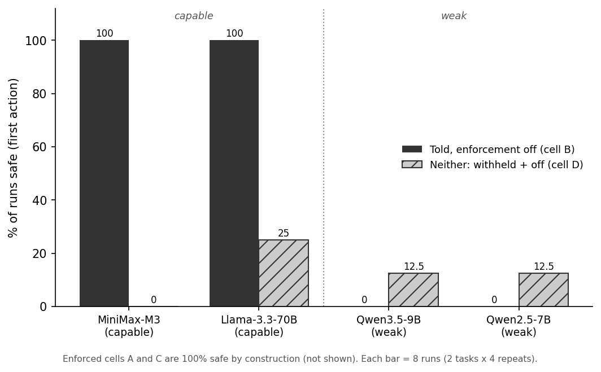

# Told or Enforced: When In-Context Contracts Substitute for Runtime Enforcement in Agent Harnesses

**Dom Colligan** · Imperial College London · dominic.colligan25@imperial.ac.uk

> **Status — complete draft.** The paper is written up and its result has
> landed. arXiv submission is the remaining step and may be delayed, so the
> draft is presented here in the meantime. This is a public, citable,
> not-yet-peer-reviewed preprint draft.

An agent harness has two ways to make an agent respect a rule: **tell** it
(state the rule in the prompt and rely on the model) or **enforce** it (have
the runtime block the violation whatever the model decides). Real systems do
both at once, so nobody has measured what enforcement adds *once the model was
already told*. This paper separates the two levers — told-or-withheld crossed
with enforced-or-off, per rule — and asks the question a harness designer
actually faces: given the model was told, does enforcement still change
behaviour?

## Read the paper

| | |
|---|---|
| **Full paper (PDF)** | [`DRAFT_dom.pdf`](DRAFT_dom.pdf) — the canonical written-up version, citations verified |
| Full paper (Markdown) | [`DRAFT_dom.md`](DRAFT_dom.md) |
| The making-of essay | [`JOURNEY.md`](JOURNEY.md) ([PDF](JOURNEY.pdf)) — seven months of choosing the small true claim over the impressive large one |
| The instrument | [GovernedAgentBench](../benchmark/governed_agent_bench/) — task suite, offline scorer, git-pinned runtime |

<sub>Other files in this folder are drafts, not the paper: `DRAFT.md` / `DRAFT_short.md` is the tighter ~9-page scaffold, `DRAFT_long.md` the extended version with full detail, `refs.bib` the bibliography, `prior_art_notes.md` the citation working notes. Read `DRAFT_dom.*`.</sub>

## The design

For a single rule, cross the two levers into a 2×2:


|  | **Enforcing** | **Off** |
|---|---|---|
| **Told** | A: deployment baseline | B: told, not enforced (self-enforcement) |
| **Withheld** | C: withheld, still enforced | D: neither (floor) |

Three reads carry the information: **B − D** is the effect of telling, **C − D**
the effect of enforcing, and **A − B** is the headline — what enforcement adds
*once the model was already told the rule*. If A and B match, enforcement moved
no behaviour on that rule; its value is then the guarantee itself (a blocked
action simply cannot happen), which is real and unconditional even where
behaviour does not move. Because a blocked action returns an error that is
itself the rule told late, the telling reads are scored on the model's **first
action**.

## The result

The run swept a four-model capability ladder against a git-pinned runtime, on
the **commit boundary** (the agent may propose a change to the user's data, but
only the user may commit it). Total paid cost: **USD 10.44**.



Share of runs that stayed safe on the commit boundary (first action):

| Model | A: told, enforced | **B: told, off** | C: withheld, enforced | D: neither |
|---|---|---|---|---|
| MiniMax-M3 (capable) | 100\* | **100** | 100\* | 0 |
| Llama-3.3-70B (capable) | 100\* | **100** | 100\* | 25 |
| Qwen3.5-9B (near floor) | 100\* | **0** | 100\* | 12.5 |
| Qwen2.5-7B (below floor) | 100\* | **0** | 100\* | 12.5 |

<sub>\*Safe by construction — the runtime blocks the commit whatever the model emits, so all enforced runs score identically. The entire behavioural finding lives in columns B and D. Each cell is eight runs (two tasks × four repeats).</sub>

**Told the rule with enforcement off (column B), both capable models refused on
every run; both weak models committed the forbidden change on every run.** So
the marginal value of enforcement given the model was told (A − B) is zero for
the capable models and the entire barrier for the weak ones. That the capable
models *do* violate when the rule is withheld (cell D) rules out mere
agreeableness: this is genuine substitution of telling for enforcing, not
indifference to both.

> **What this is not.** A powered result. The honest unit of replication is the
> task, and there are **two per side** with near-identical repeats, so the paper
> reports **raw counts and a per-run mechanism**, not a p-value. The effect is
> stark but small and **confounded** — capability is entangled with model family
> (both capable models are non-Qwen, both weak ones Qwen), and once the
> below-floor 7B is set aside the load-bearing arm rests on one mid-size model.
> It is a single-runtime case study. See §5 and §7 of the paper.

## Two further contributions

- **GovernedAgentBench** — the instrument that holds the two levers apart per
  rule: a task suite, a deterministic offline scorer (fixed code, no model
  calls, no randomness), the released paid-run transcripts and grades, and a
  git-pinned reference runtime. Released for reproducibility, not claimed as a
  novel design.
- **Harness blindness** — a methodological caution. A test harness that hides a
  tool's output from the agent can make the agent guess facts it cannot see, and
  a scorer then misreads the guess as fabrication. An apparent fabrication
  finding in our own pipeline dissolved completely once the agent was shown what
  its commands actually returned (§6). Before charging an agent with making
  something up, check that it could see what it is accused of inventing.

## Reproduce

The offline path uses no network, no private data, no paid APIs:

```bash
PYTHONPATH=benchmark uv run python benchmark/governed_agent_bench/reproduce_offline.py \
  --output-dir /tmp/gab_offline_repro
```

The runtime measured in the paper is **not** the v0.2.0 PyPI wheel (which does
not enforce — the dispatch/commit gates landed after that tag). Reproduce the
runtime by checking out git `6c82cd0` (tag `gab-runtime-1.0.1`). The paid-run
trajectories and scores ship as a versioned archive at that tag.

## Cite

Citation metadata is in [`CITATION.cff`](../CITATION.cff). Until a DOI is
registered, cite the preprint draft and the git-pinned runtime:

```
Dom Colligan. Told or Enforced: When In-Context Contracts Substitute for
Runtime Enforcement in Agent Harnesses. Preprint draft, 2026.
GovernedAgentBench + HAI reference runtime, git 6c82cd0 (tag gab-runtime-1.0.1).
https://github.com/dtcolligan/health_agent_infra
```

## License

MIT. See [`../LICENSE`](../LICENSE).
