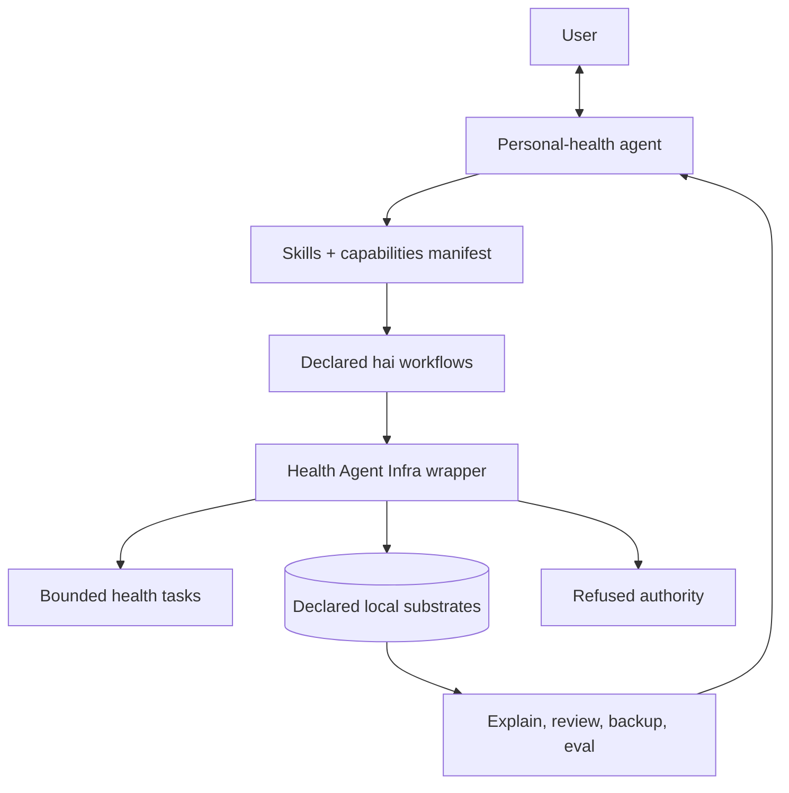
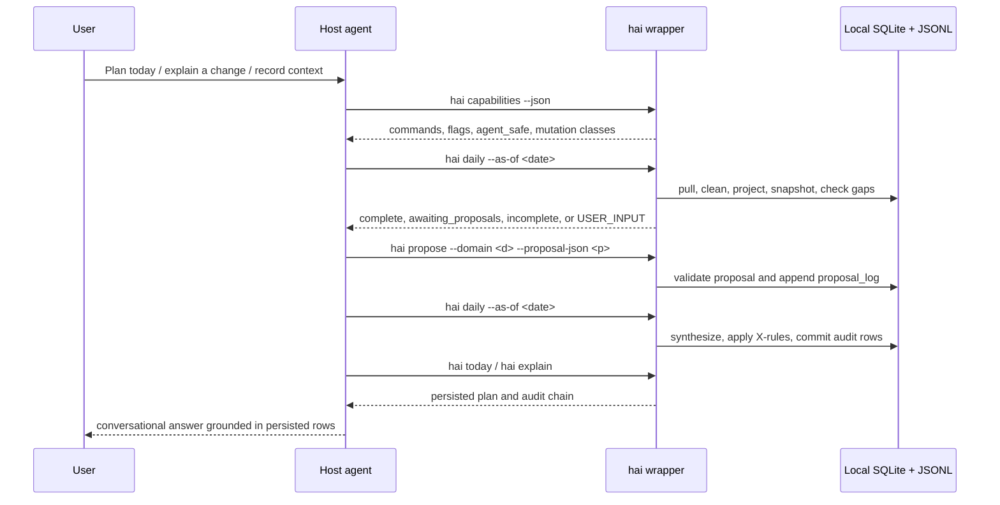
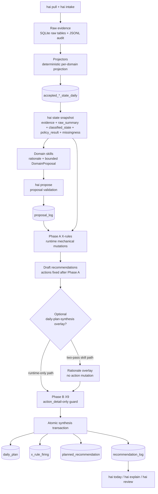
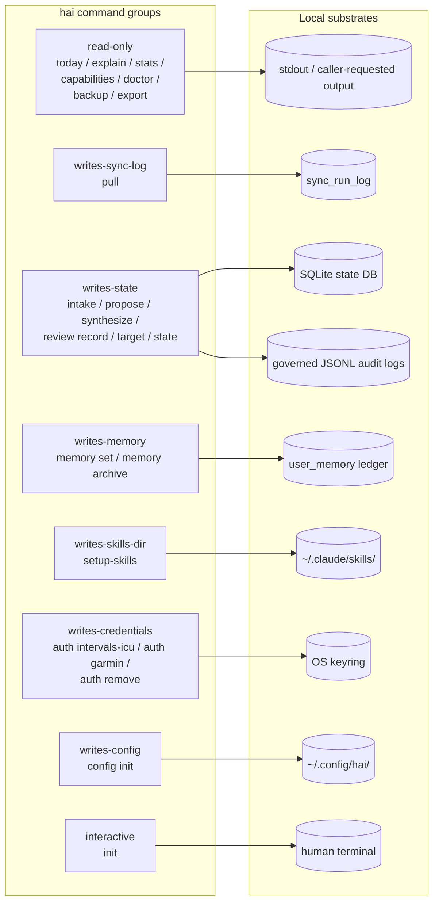

# Architecture

Health Agent Infra is the local plugin/runtime wrapper around a
shell-capable personal-health agent. The user speaks to the agent; the
agent operates `hai`; `hai` defines the allowed tasks, validates the
agent's outputs, owns the local write path, and records the audit trail.

That framing matters. The architecture is not "a Python app that happens
to have an agent front end." It is infrastructure around an agentic AI
system so the agent can work on personal health data without becoming the
database, policy engine, migration layer, validator, clinical authority, or
final write path.

The wrapper enables the agent to:

- pull and distinguish wearable / fixture / manual evidence;
- preserve durable local health state outside chat memory;
- project raw evidence into typed daily rows;
- read deterministic classifications and policy firings before proposing;
- write bounded DomainProposal rows instead of free-form plans;
- synthesize, explain, review, back up, and export through governed commands.

The wrapper prevents the agent from:

- editing SQLite or JSONL state directly;
- inventing actions outside a domain's enum;
- silently activating user intent or nutrition/training targets;
- treating missing, stale, fixture, or unavailable evidence as equivalent;
- bypassing X-rule reconciliation or the three-state audit chain;
- presenting unsupported clinical or autonomous diet/training-plan authority.

This doc covers the architecture of that wrapper: what the agent is told to
call, what those calls may mutate, which validation layers stand between
the agent and state, and how current/future evals judge the behavior. For
positioning language see
[`personal_health_agent_positioning.md`](personal_health_agent_positioning.md).
For what lives on disk see [`memory_model.md`](memory_model.md). For the
classes of user question the wrapper is built to support see
[`query_taxonomy.md`](query_taxonomy.md).

## Agent-wrapper model



Read the diagram left-to-right from the agent's perspective:

1. The agent receives user intent in natural language.
2. The agent reads skills and `hai capabilities --json` to discover which
   tasks are allowed.
3. The agent invokes `hai`; it does not improvise database writes, schema
   changes, hidden memory, or final plans.
4. `hai` validates inputs, mutates only declared local substrates, and
   records rows that can later be explained, reviewed, backed up, or scored.

`Bounded health tasks` means pull, intake, snapshot, classify, propose,
synthesize, explain, review, and backup/export. `Declared local substrates`
means SQLite state, governed JSONL audit logs, keyring/config, and explicit
caller-requested output files. `Refused authority` means direct database
edits, invented actions, silent targets, unsafe source use, unsupported
clinical claims, and confidence on missing evidence.

The wrapper's authority is deliberately narrower than "own health." It owns
local state governance, not the user's goals. It owns deterministic
classification and policy application, not the user's lived judgment. It owns
the final write path, not the agent's conversational relationship with the
user.

## Agent journey



This is the product path. The agent may decide which workflow matches the
conversation, but every health-state mutation goes through `hai`.

## Six domains in v1

| Domain | What it reasons about |
|---|---|
| recovery | Is the body recovered enough for today's planned training? |
| running | Is today's planned run appropriate given recent form? |
| sleep | Is sleep adequate to proceed; is chronic deprivation building? |
| stress | Is stress state eroding readiness; is it sustained? |
| strength | Is recent strength volume aligned with the training block? |
| nutrition | Are today's macros aligned with training demand? (macros-only in v1 — see non_goals.md) |

The ordering reflects historical build order (recovery was first; nutrition
was last) and increasing effort per phase, not a reasoning
precedence. Synthesis does not privilege one domain over another.

## Runtime pipeline under the wrapper

This is the implementation pipeline the wrapper exposes to the agent. It is
not the product perspective; it is what happens after the agent has chosen a
governed `hai` workflow.



```
┌─────────────────────────────────────────────────────────────────────┐
│              INTAKE — source + user-authored                        │
│                                                                     │
│  hai pull [--source ...] hai intake gym        hai intake nutrition │
│                         hai intake stress      hai intake note      │
│                         hai intake exercise    hai intake readiness │
└─────────────────────────────┬───────────────────────────────────────┘
                              │
                              ▼ (raw evidence, append-only JSONL + raw tables)
┌─────────────────────────────────────────────────────────────────────┐
│              PROJECTORS — per-domain, deterministic                 │
│                                                                     │
│  core/state/projector.py + projectors/{recovery, sleep, stress,     │
│                          strength, nutrition, running_activity}.py  │
└─────────────────────────────┬───────────────────────────────────────┘
                              │
                              ▼ (canonical accepted_*_state_daily tables
                                 + running_activity per-session rows)
┌─────────────────────────────────────────────────────────────────────┐
│                     STATE SNAPSHOT                                  │
│              hai state snapshot --as-of <date>                      │
│                                                                     │
│  Returns per-domain block:                                          │
│    - evidence       (the raw accepted row)                          │
│    - raw_summary    (deltas, ratios, coverage)                      │
│    - classified_state   (bands, scores — from domains/<d>/classify) │
│    - policy_result      (R-rule firings — from domains/<d>/policy)  │
│    - missingness        (absent | partial | unavailable | pending)  │
└─────────────────────────────┬───────────────────────────────────────┘
                              │
                              ▼
┌─────────────────────────────────────────────────────────────────────┐
│            DOMAIN SKILLS — judgment, per domain                     │
│                                                                     │
│  skills/recovery-readiness     running-readiness                    │
│         sleep-quality          stress-regulation                    │
│         strength-readiness     nutrition-alignment                  │
│                                                                     │
│  Each reads its snapshot block + the already-computed               │
│  classified_state + policy_result. Honours forced_action and        │
│  capped_confidence from policy; composes rationale; emits a         │
│  DomainProposal validated + appended via `hai propose`.             │
└─────────────────────────────┬───────────────────────────────────────┘
                              │
                              ▼ (proposal_log, persisted)
┌─────────────────────────────────────────────────────────────────────┐
│        SYNTHESIS PHASE A — cross-domain X-rules (pre-skill)         │
│                                                                     │
│  Runtime: evaluates 10 Phase A X-rules against snapshot +           │
│           proposals; emits firings; applies mutations mechanically. │
│  Skill  : daily-plan-synthesis reads bundle + firings, composes     │
│           rationale overlay on top of already-fixed actions.        │
└─────────────────────────────┬───────────────────────────────────────┘
                              │
                              ▼ (N draft recommendations, actions now fixed)
┌─────────────────────────────────────────────────────────────────────┐
│       SYNTHESIS PHASE B — post_adjust (action_detail only)          │
│                                                                     │
│  Runtime: evaluates post_adjust-tier rules (X9) against finalised   │
│           drafts. MAY mutate only action_detail on specific target  │
│           domains; a write-surface guard rejects any firing that    │
│           would change action or touch a non-target domain.         │
│                                                                     │
│  Output: N final per-domain recommendations linked by daily_plan_id │
│          All writes commit in one SQLite transaction (daily_plan    │
│          + x_rule_firing rows + recommendation_log rows). Canonical │
│          plan is idempotent on (for_date, user_id).                 │
└─────────────────────────────┬───────────────────────────────────────┘
                              │
                              ▼
┌─────────────────────────────────────────────────────────────────────┐
│                        REVIEW — per-domain                          │
│    hai review schedule / record / summary                           │
└─────────────────────────────────────────────────────────────────────┘
```

## Authority boundaries

The important architectural boundary is not "code versus prose." It is
authority: what the agent may decide, what it may ask `hai` to do, and what
the wrapper is allowed to mutate.

| Layer | Allowed authority | Explicitly not allowed |
|---|---|---|
| User | Set goals, approve commitments, provide missing context, reject recommendations. | None; the user is the principal. |
| Agent | Converse, choose workflows, ask clarifying questions, invoke declared `hai` commands, draft bounded proposals through skills. | Direct database/JSONL edits, hidden memory, invented action enums, silent target activation, clinical authority. |
| Skills | Rationale, uncertainty framing, clarification, bounded proposal composition from supplied snapshot/policy fields. | Arithmetic bands, policy firings, action mutation, persistence. |
| `hai` CLI/runtime | Validation, state mutation, projection, classification, R-rules, X-rules, synthesis, explainability, review, backup/restore/export. | Free-form coaching prose or user-goal ownership. |
| Evals | Current deterministic tests and scenario fixtures; future personal-guidance / skill harness scoring. | Replacing the runtime write path or letting an LLM self-certify. |

**Runtime/code owns:**
- Deterministic arithmetic (band classification, scoring, signal
  counting).
- Mechanical policy rules (R-rules per domain; X-rules cross-
  domain).
- Parsing of user narration into structured rows (gym sets,
  nutrition macros, stress score).
- Taxonomy lookup ranking (exercise taxonomy today; food taxonomy
  deferred per Phase 2.5 retrieval-gate outcome).
- X-rule mutation application, tier precedence, Phase B write-
  surface guard.
- Atomic transaction around daily_plan + firings + recommendations.
- Schema validation at the proposal, synthesis, review, and intake boundaries.

**Skills own:**
- Composing rationale prose for an already-fixed action.
- Deciding when to ask the user a clarifying question (e.g.
  strength-intake disambiguating "squats" → back vs front).
- Surfacing uncertainty the runtime cannot itself resolve (data-
  gaps, ambiguous narration).
- Joint-rationale reconciliation during synthesis when multiple
  domains' firings share a signal.

Skills never mutate actions. Skills never run arithmetic the
runtime already ran. A skill that tries to compute a band has
regressed into code's territory and should be rewritten.

## R-rules (per-domain mechanical policy)

Each domain's ``policy.py`` implements a small R-rule set that the
classifier + snapshot bundle feeds into. Common ids:

- ``require_min_coverage`` — missing required inputs forces
  ``defer_decision_insufficient_signal``.
- ``no_high_confidence_on_sparse_signal`` — sparse coverage caps
  confidence at ``moderate``.
- Domain-specific escalation rules (recovery RHR-spike, running
  ACWR-spike, sleep chronic-deprivation, stress sustained-high,
  strength volume-spike, strength unmatched-taxonomy, nutrition
  extreme-deficiency).

See the domain classifiers under
``src/health_agent_infra/domains/<d>/classify.py`` and policies at
``domains/<d>/policy.py`` for the authoritative list of bands and
rule firings.

### Nutrition target-aware path

Nutrition keeps the v1 macros-only boundary, but v0.1.15 made the
classification path target-aware. `hai intake gaps` computes a
read-side presence block with `present.*.logged`, `is_partial_day`,
and a three-valued `target_status` (`present`, `absent`,
`unavailable`) from `core/intake/presence.py`. Snapshot construction
threads those W-A signals through `derive_nutrition_signals`, so the
production `hai daily` path reaches the same classifier behavior as
the direct domain tests. When the day is partial and no active
nutrition target covers the date, `domains/nutrition/classify.py`
short-circuits to `nutrition_status='insufficient_data'` instead of
misclassifying breakfast-only intake against a baseline. The
`merge-human-inputs` skill consumes the same presence block to choose
recap vs forward-march framing.

## X-rules (synthesis-layer cross-domain)

See [``x_rules.md``](x_rules.md) for the full catalogue.

## State model

See [``state_model_v1.md``](state_model_v1.md) for the human-readable
table-by-table schema. Each accepted_*_state_daily table is
deterministically derived from one or more raw + source tables by
the projector. Schema head is 025 as of v0.1.15. The exact migration
ledger lives in the migration files; `state_model_v1.md` carries the
human-readable table map and the latest notable deltas.

## Agent-native surfaces

The runtime is built so the agent can translate natural-language user intent
into a bounded CLI workflow without changing the governance model:

- **Three-state audit chain.** `planned_recommendation` (migration
  011) persists the aggregate pre-X-rule bundle alongside the
  existing `daily_plan` + `recommendation_log`. `hai explain` renders
  `planned → adapted → performed` side-by-side.
- **Agent CLI contract.** Every `hai` subcommand carries contract
  metadata (mutation class, idempotency, JSON output, exit codes,
  agent-safe flag). `hai capabilities --json` emits a manifest walked
  from the argparse tree; the markdown mirror lives at
  [``agent_cli_contract.md``](agent_cli_contract.md). All handlers
  return from the stable `OK / USER_INPUT / TRANSIENT / NOT_FOUND /
  INTERNAL` taxonomy.
- **Daily next-actions manifest.** `hai daily --auto` emits versioned
  `next_actions[]` entries with concrete `command_argv`, retry semantics,
  and after-success routing so the agent can continue the loop from the
  runtime's structured report.
- **Sentence-form X-rule explanations.** Every firing carries both a
  stable slug (`sleep-debt-softens-hard`) and a one-sentence
  `human_explanation` the agent narrates verbatim.
- **Authoritative intent-router skill.** Maps NL intent to CLI
  workflow sequences by reading the capabilities manifest as its
  source of truth. Teaches the agent `hai` the way Claude already
  knows `gh`. See [``agent_operable_runtime_plan.md``](../plans/historical/agent_operable_runtime_plan.md)
  for the full cycle context.

## Command contract and mutation substrates

The agent is instructed to treat `hai capabilities --json` as the source of
truth. If a workflow is not in the manifest or a skill does not route to it,
the agent should ask for clarification or stop; it should not create an
ad hoc file, issue raw SQL, or mutate JSONL directly.

The manifest's mutation classes map to concrete local substrates:



Each command declares exactly one class. `agent_safe == false`
commands (W57-gated commit/archive paths under `intent` and `target`,
plus `interactive` setup) require a user prompt rather than agent
invocation. See [`agent_integration.md`](agent_integration.md) for the
operational protocol.

| Mutation class | May touch | Examples |
|---|---|---|
| `read-only` | No mutation of local state/config/credentials; may print output or write an explicit caller-requested backup/export destination | `hai today`, `hai explain`, `hai stats`, `hai capabilities`, `hai backup`, `hai export` |
| `writes-sync-log` | `sync_run_log` freshness rows only | `hai pull` |
| `writes-audit-log` | JSONL audit logs without primary state mutation | Reserved class in the manifest schema; proposal/review writes currently pair audit logging with state writes. |
| `writes-state` | SQLite state DB and governed JSONL logs when the command has an audit sidecar | `hai intake *`, `hai propose`, `hai synthesize`, `hai review record`, `hai target *`, `hai state *` write paths |
| `writes-memory` | `user_memory` ledger | `hai memory set`, `hai memory archive` |
| `writes-skills-dir` | Local skills installation directory | `hai setup-skills` |
| `writes-credentials` | OS keyring or null-backend credential state | `hai auth intervals-icu`, `hai auth garmin`, `hai auth remove` |
| `writes-config` | User threshold/config files | `hai config init` |
| `interactive` | Live human setup flow; not agent-invocable | `hai init` |

Those classes are not documentation decoration. They are the contract the
agent works under: a task may only mutate the substrate declared by the
command, and payload validators decide whether the mutation is admitted. The
critical write paths (`propose`, `synthesize`, `review`, `intent`, `target`,
and intake) preserve named invariant failures so an agent can recover by
asking the user or running the next safe command.

The same boundary is the future evaluation boundary. Current tests already
score deterministic commands, schema invariants, doc freshness, and scenario
fixtures. The next evaluation layer should judge whether the agent uses the
manifest correctly: choosing the right command, refusing unsupported
shortcuts, asking for missing evidence, and keeping rationale inside the
runtime's bounded action space.

## Package layout

```
src/health_agent_infra/
    cli.py                          # unified hai dispatcher
    core/
        schemas.py                  # BoundedRecommendation[ActionT] base
        validate.py                 # shared invariants
        config.py                   # DEFAULT_THRESHOLDS + loader
        synthesis.py                # Phase A + Phase B orchestration
        synthesis_policy.py         # X-rule evaluators
        writeback/
            proposal.py             # DomainProposal validation + JSONL
            outcome.py              # review-outcome validation
        explain/                    # hai explain queries + renderer
        memory/ intent/ target/     # user memory + v0.1.8 ledgers
        data_quality/               # data_quality_daily projection
        state/
            snapshot.py             # cross-domain bundle builder
            store.py                # SQLite connection + migrations
            projector.py            # orchestrator
            projectors/{recovery,running_activity,sleep,stress,strength,nutrition}.py
            # accepted running daily projection still lives in projector.py
            migrations/001…025.sql
        clean/                      # hai clean deterministic prep
        pull/                       # CSV fixture, intervals.icu, Garmin live + auth
        review/                     # schedule / record / summarize
        intake/                     # shared intake helpers
    domains/
        recovery/   {schemas, classify, policy}.py
        running/    {schemas, classify, policy, signals}.py
        sleep/      {schemas, classify, policy, signals}.py
        stress/     {schemas, classify, policy, signals, intake}.py
        strength/   {schemas, classify, policy, signals, intake,
                     taxonomy_match}.py + taxonomy_seed.csv
        nutrition/  {schemas, classify, policy, signals, intake}.py
    skills/                         # packaged with the wheel
        recovery-readiness/SKILL.md
        running-readiness/SKILL.md
        sleep-quality/SKILL.md
        stress-regulation/SKILL.md
        strength-readiness/SKILL.md
        nutrition-alignment/SKILL.md
        daily-plan-synthesis/SKILL.md
        strength-intake/SKILL.md
        merge-human-inputs/SKILL.md
        intent-router/SKILL.md
        expert-explainer/SKILL.md
        review-protocol/SKILL.md
        safety/SKILL.md
        reporting/SKILL.md
reporting/
    docs/                           # this doc + friends
    artifacts/flagship_loop_proof/  # eval runner captures
    plans/                          # roadmap + release/audit plans
    experiments/                    # Phase 0.5 / 2.5 throwaway prototypes
verification/
    tests/                          # unit + contract + integration tests
    evals/                          # dev-reference eval docs + harness notes
src/health_agent_infra/evals/       # packaged deterministic eval runner
    scenarios/{domain,synthesis}/
    rubrics/
    runner.py
```

## CLI surface (v1)

This section is a workflow sketch, not the exhaustive command
contract. The authoritative command list, flags, mutation classes,
idempotency, JSON behavior, and agent-safety metadata are generated
from the live argparse tree at
[`agent_cli_contract.md`](agent_cli_contract.md) and
`hai capabilities --json`.

```
hai auth intervals-icu | garmin               # keyring credential storage
hai auth status

hai pull [--source csv|intervals_icu|garmin_live] --date <YYYY-MM-DD>
hai clean --evidence-json <p>                  # raw → CleanedEvidence + RawSummary
hai daily [--source ...] [--auto] [--explain] [--domains <csv>]

hai intake gym      --session-json <p>         # per-set + bulk modes
hai intake exercise --name <canonical>         # user-defined taxonomy row
hai intake nutrition --calories ... --protein-g ... [macros]
hai intake stress   --score 1..5 [--tags ...]
hai intake note     --text ...
hai intake readiness --soreness low|moderate|high --energy low|moderate|high

hai state init | migrate | read | snapshot | reproject

hai state snapshot --evidence-json <p> --as-of <d> --user-id <u>
# Emits classified_state + policy_result for every domain in one call.
# (The legacy recovery-only `hai classify` / `hai policy` debug CLIs
# were removed in v0.1.4 — see `reporting/plans/v0_1_4/adr_classify_policy_cli.md`.)
# For multi-scenario sweeps use the eval runner: `hai eval run --domain <d>`.

hai propose  --domain <d> --proposal-json <p> --base-dir <root>
hai synthesize --as-of <d> --user-id <u>                        # six-domain atomic commit
hai synthesize --as-of <d> --user-id <u> --bundle-only          # read-only skill seam
hai synthesize --as-of <d> --user-id <u> --drafts-json <p>      # skill overlay pass

hai explain --for-date <d> --user-id <u> [--operator]            # read-only audit-chain reconstruction
hai explain --daily-plan-id <id> [--operator]                    # exact-plan form (incl. _v<N> variants)

hai review schedule --recommendation-json <p> --base-dir <root>
hai review record --outcome-json <p> --base-dir <root>
hai review summary [--domain <d>] --base-dir <root>

hai config init | show | validate | diff
hai memory set | list | archive
hai intent training add-session | training list | sleep set-window | list | archive
hai target set | list | archive
hai exercise search --query <free-text>
hai research topics | search --topic <t>
hai today [--as-of <d>] [--domain <d>] [--format json]
hai stats [--outcomes|--data-quality|--baselines|--funnel]
hai eval run --domain <d> | --synthesis [--json]

hai setup-skills [--dest ~/.claude/skills] [--force]
```

## Determinism boundaries

The two primary recommendation boundaries are:

1. **``hai propose``** — every DomainProposal is validated against
   ``core/writeback/proposal.py:validate_proposal_dict``:
   schema_version per-domain, action in the domain's v1 enum, confidence
   enum, banned fields absent (``follow_up``, ``daily_plan_id``,
   ``recommendation_id``), non-empty policy_decisions.

2. **``hai synthesize``** — refuses when no proposals reached
   proposal_log; rolls back the entire transaction on any failure;
   Phase B firings are guarded against writing anything other than
   ``action_detail`` on a registered target domain. Per-domain
   BoundedRecommendation validation for all six domains happens inside
   ``run_synthesis`` via ``project_bounded_recommendation``. (The
   legacy recovery-only ``hai writeback`` direct path was removed in
   v0.1.4 D2.)

Both points reject loudly with the `USER_INPUT` exit class when caller input
violates the contract; validation failures carry named ``invariant`` ids where
callers need programmatic recovery. Intake, review, intent, and target commands
have their own validators, but they do not change the recommendation action
space.

## How an agent uses this

One Claude agent reads the bundle from ``hai state snapshot`` and
the domain skills from ``~/.claude/skills/``. Per-domain, it emits a
proposal via ``hai propose``. Once all proposals for a (for_date,
user_id) are in, the agent has two paths:

- **Runtime-only path (`hai daily` or a single `hai synthesize`
  call without `--drafts-json`).** The runtime evaluates Phase A,
  applies mutations mechanically to drafts, runs Phase B, and
  atomically commits. Rationale is the per-proposal text the
  domain skills already wrote — the synthesis skill is NOT
  invoked.
- **Skill-overlay path (two-pass `hai synthesize`).** The agent
  first calls `hai synthesize ... --bundle-only` (read-only) to
  emit `(snapshot, proposals, phase_a_firings)`. The
  daily-plan-synthesis skill composes a rationale overlay and the
  agent then calls `hai synthesize ... --drafts-json <path>` to
  finish the commit. The runtime applies the overlay onto the
  mechanical drafts (rationale + uncertainty + review_question
  only), then runs Phase B, then atomically commits.

`hai daily` ships the runtime-only path today: it stops cleanly at
the proposal gate (`overall_status=awaiting_proposals`) when no
proposals are present, but it does not orchestrate the two-pass
skill overlay. The two-pass path is opt-in for an agent that wants
to drive the synthesis skill explicitly.

``hai review`` captures outcomes for the next morning.

See [``agent_integration.md``](agent_integration.md) for the
concrete Claude Code / Agent SDK wiring.
